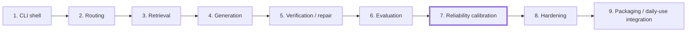
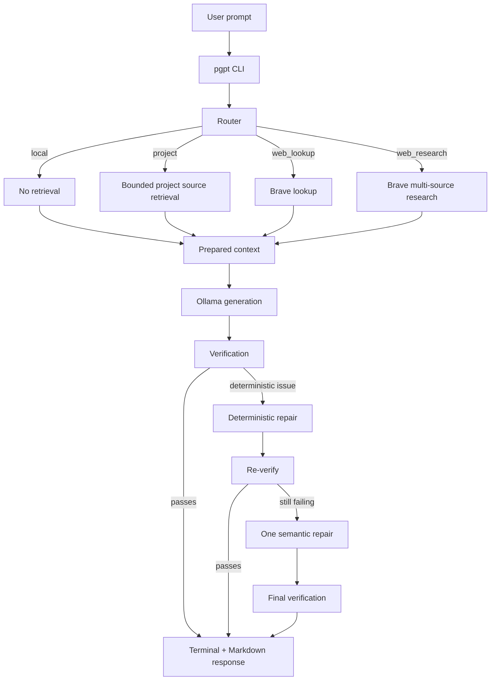
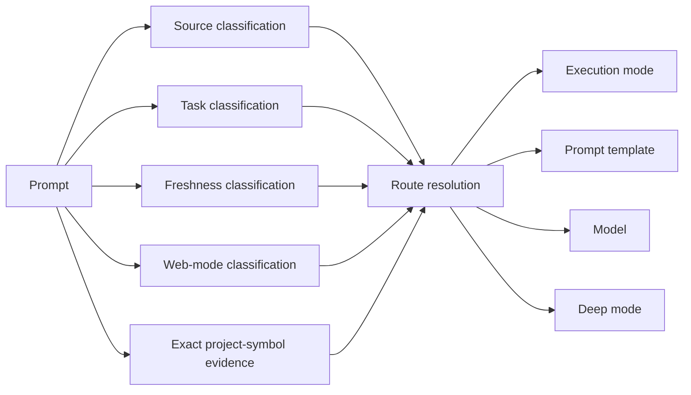
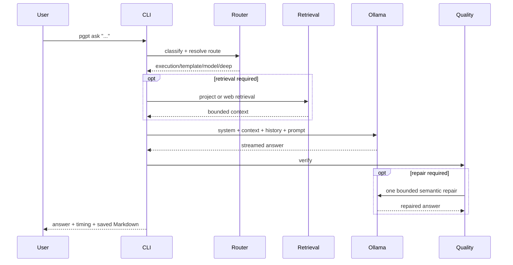
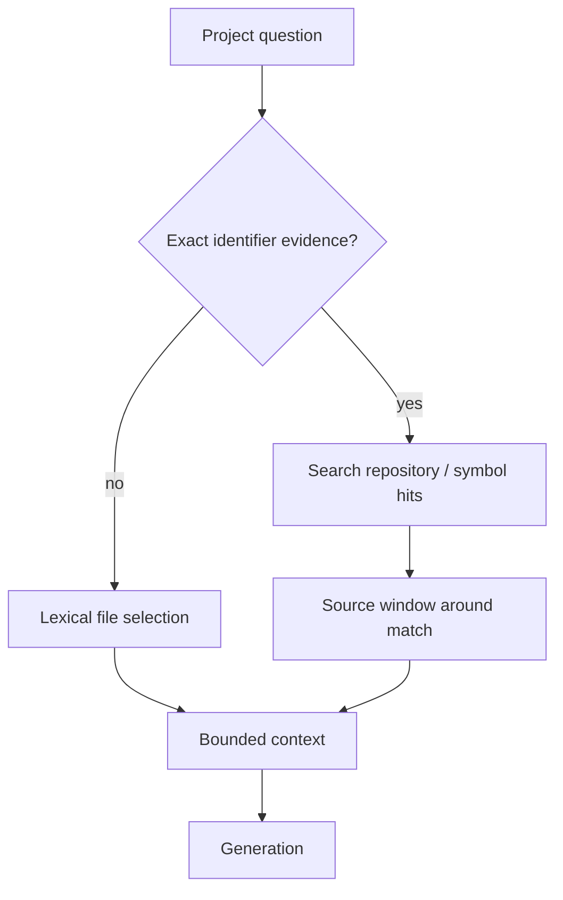
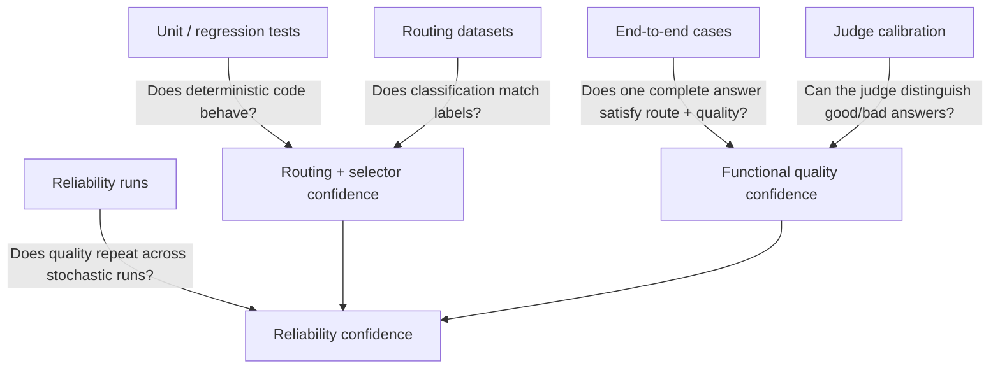
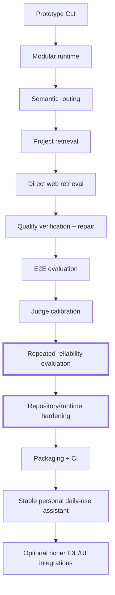

# pgpt-cli v3

A modular local AI assistant built around Ollama, deterministic/semantic routing, bounded project retrieval, direct Brave web retrieval, answer verification, and repeatable evaluation tooling.

The project is intended to provide a fast personal development assistant without requiring the PrivateGPT agent loop for ordinary questions. PrivateGPT remains available for the existing sync/ingest/serve workflow, while `pgpt ask` can route directly to local generation, project source retrieval, or live web retrieval.

## Where the project is now

`pgpt-cli` has moved beyond the initial CLI prototype. The main runtime path exists end-to-end, routing and model-selection infrastructure have dedicated tests/evals, web research has citation verification/repair, and reliability tooling now supports repeated runs without discarding already-completed results.



**Current position: Phase 7 — reliability calibration, entering hardening.**

The current reliability artifact records **5/5 successful runs for `research_web_01`** using `qwen3.5:4b` as both generation override and judge: routing, deterministic citation checks, semantic judgment, and overall quality all passed on all five runs. This is encouraging but intentionally narrow: it validates that research case under that configuration, not the reliability of every route or every configured model.

The next milestone is therefore **not another architectural rewrite**. It is to harden the existing boundaries, remove duplicated/generated repository state, broaden reliability coverage across local/debug/implementation/architecture/project routes, and only then treat the CLI as a stable daily-use tool.

## Runtime architecture



The runtime is deliberately bounded: retrieval is selected before final generation, source context is limited, generation has a token budget, and repair is bounded rather than becoming an open-ended agent loop.

## Routing model



Natural-language routing policy belongs primarily under `prompts/routing/`; Python should implement mechanisms, parsing, scoring, and invariants rather than accumulating task-specific English keyword rules.

## Repository structure

```text
pgpt-cli/
├── pgpt.py                     # small executable entry point
├── config.json                 # runtime/model/retrieval configuration
├── pgpt/
│   ├── cli.py                  # CLI commands and interactive chat
│   ├── config.py               # configuration + secret loading
│   ├── maintenance.py          # PrivateGPT compatibility workflows
│   ├── generation/ollama.py    # Ollama streaming
│   ├── models/selector.py      # model selection
│   ├── output/stream.py        # terminal/Markdown output
│   ├── quality/                # citation checks, verification, repair
│   ├── retrieval/              # project + Brave web retrieval
│   ├── routing/                # classifiers, rules, route resolution
│   ├── runtime/                # pipeline, route, status, timing, HTTP
│   └── storage/chats.py        # local chat persistence
├── prompts/
│   ├── routing/                # semantic routing policy
│   ├── retrieval/              # project-symbol rules/data
│   └── quality/                # judge instructions
├── tests/                      # deterministic/unit regression tests
├── tools/                      # benchmarks, E2E scoring, reliability runs
├── evals/                      # cases plus current evaluation artifacts
├── chats/                      # local conversation state (currently tracked)
└── state/                      # generated routing/runtime state (currently tracked)
```

## Request lifecycle



## Models and configuration

Current configured roles are defined in `config.json`. At the current commit they include:

```text
router     qwen3:1.7b
general    llama3.2:3b
coder      qwen2.5-coder:3b
reasoning  phi4-mini
deep       phi4-mini
embedding  qwen3-embedding:0.6b
```

Model choice should be treated as benchmark-driven configuration rather than a permanent architectural assumption.

## Brave web retrieval

Secrets are kept outside the repository. Create/edit:

```bash
nano ~/.config/pgpt/secrets.env
```

and set:

```text
PGPT_BRAVE_API_KEY=your_key
```

Do not commit the real key. `secrets.env.example` intentionally contains only an empty placeholder.

Web execution has two modes:

```text
web_lookup    -> small bounded result set for current/factual lookup
web_research  -> multiple independent sources + page excerpts + source IDs
```

Research answers use `[S1]`, `[S2]`, ... as application-level source identifiers and append a clickable Sources footer. The quality layer can deterministically check whether substantive research text actually contains the required inline source IDs.

## Project retrieval

Exact code identifiers are handled differently from broad project questions:



This keeps a named function/class lookup from depending on vector similarity to guess which source file contains the symbol.

## Core commands

Run from the repository root. A convenient local alias is:

```bash
alias pgpt='python3 ~/ai/pgpt-cli/pgpt.py'
```

Then:

```bash
pgpt status
pgpt models
pgpt validate "What is dependency injection?"
pgpt ask "What is dependency injection?"
pgpt ask "Explain getYoutubeVideoMetadata in my project."
pgpt ask "What's Ottawa's weather today?"
pgpt ask "Research current AI privacy approaches and compare sources."
```

PrivateGPT-compatible maintenance commands remain available:

```bash
pgpt sync
pgpt ingest
pgpt serve
```

`pgpt ask` does not require `pgpt serve`.

## Interactive chat

```bash
pgpt chat-new "YouTube metadata"
pgpt chat
```

Inside chat:

```text
/web auto|on|off|research
/context auto|on|off
/deep auto|on|off
/new TITLE
/quit
```

## Tests and evaluation layers

The project now has several distinct validation layers. They should not be treated as interchangeable.



Useful commands:

```bash
python3 -m unittest discover -s tests -v
python3 -m tools.run_end_to_end_evals
python3 -m tools.score_end_to_end_results --model qwen3.5:4b
python3 -m tools.calibrate_quality_judge --model qwen3.5:4b
```

Reliability evaluation is intentionally resumable: completed runs are retained unless `--fresh` or `--force` is explicitly requested. This matters because local model + judge runs are expensive.

Example:

```bash
python3 -m tools.run_reliability_evals \
  --case research_web_01 \
  --runs 5 \
  --judge-model qwen3.5:4b \
  --generation-model qwen3.5:4b
```

## Current evidence

At this commit, the strongest stored repeated-run evidence is:

```text
research_web_01
  runs                    5
  route pass              5/5
  deterministic pass      5/5
  semantic pass           5/5
  judge success           5/5
  overall quality pass    5/5
  mean score              5.0
```

This result should **not** be generalized to the whole application yet. The reliability artifact currently contains one case, and it used a generation-model override. The broader E2E suite and routing tests provide additional functional evidence, but repeated reliability coverage still needs to be expanded deliberately.

## Hardening backlog

Before calling v3 stable, the repository should be cleaned up in this order:

1. **Move remaining natural-language runtime instructions out of Python.** `pgpt/runtime/pipeline.py` still constructs English runtime/continuation instructions in code. Those should become prompt assets or structured prompt templates so Python remains mechanism-focused.
2. **Consolidate prompt ownership.** There are top-level answer templates such as `prompts/architecture.md` and routing templates such as `prompts/routing/templates/architecture.md`. Their responsibilities should be made explicit or consolidated to prevent two sources of truth.
3. **Separate source-controlled fixtures from generated state.** `chats/testing-v3/`, live `state/` artifacts, current eval outputs, and archived eval outputs are presently committed. Decide which are intentional fixtures/baselines and ignore/move the rest.
4. **Remove stale documentation assumptions.** Earlier documentation referred to an `install-v3.sh` script and a `backups/` workflow that are not part of the current repository tree. This README no longer depends on that missing installer.
5. **Broaden reliability evaluation without discarding existing expensive runs.** Add/resume repeated coverage for general, debug, implementation, architecture, project-symbol, project-broad, web lookup, and research paths.
6. **Add packaging only after behavior stabilizes.** The repository currently runs directly from source; a `pyproject.toml`/console entry point can come after the runtime/eval boundaries stop moving.
7. **Add CI after deciding which tests are deterministic and hardware/network independent.** Local Ollama/Brave reliability tests should not become mandatory GitHub CI checks unless explicitly designed for that environment.

## Grand-scheme roadmap



The current work sits at the **I → J transition**: the architecture is present and a representative research path has passed repeated reliability evaluation; the immediate priority is to harden and simplify what already exists before adding another major subsystem.

## Design principles

- Local-first generation through Ollama.
- Retrieval only when routing establishes a retrieval requirement.
- Exact project symbols should use deterministic source evidence before fuzzy retrieval.
- Web research should preserve source identity through generation and verification.
- Natural-language behavior belongs in prompt/config assets; Python should primarily implement mechanisms and invariants.
- Expensive evaluations should be resumable and should preserve completed runs by default.
- Reliability claims must be scoped to the cases/models actually measured.
- Prefer bounded, inspectable pipelines over autonomous retry/tool loops.
